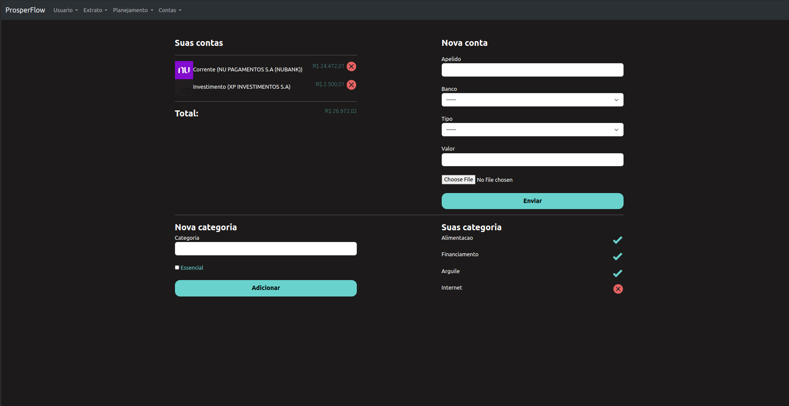

# ProsperFlow
ProsperFlow é uma aplicação web simples e direta para gerenciamento financeiro pessoal. Foi construída com o objetivo de manter as coisas o mais simples possível, sem comprometer a funcionalidade.

A aplicação foi construída usando Python e Django, e segue a estrutura padrão de um projeto Django. O projeto consiste em vários aplicativos Django, cada um responsável por uma parte específica da funcionalidade:

UserProfile: Gerencia os perfis dos usuários.
bill: Gerencia as contas a pagar.
core: Contém a lógica central da aplicação.
planning: Gerencia o planejamento financeiro.
extract: Gerencia os extratos financeiros.
Além disso, temos o diretório templates que contém os templates HTML usados na aplicação.

# Propósito
A aplicação foi construída de forma a ser fácil de entender e modificar. Seja você um desenvolvedor experiente ou um iniciante, você deve ser capaz de entender a estrutura do projeto e a lógica por trás dele sem muita dificuldade.

As técnicas mais avançadas de comunicação como APIRest nao foram empregradas para manter a simplicidade e poderão ser adicionadas ao longo do tempo ou por contribuidores.

# Contribuição
Contribuições para o ProsperFlow são muito bem-vindas! Se você tem uma ideia para melhorar a aplicação ou encontrou um bug, sinta-se à vontade para abrir uma issue ou um pull request.

Ao contribuir, por favor, certifique-se de seguir as melhores práticas de desenvolvimento e de manter a simplicidade do código. O objetivo do ProsperFlow é ser uma aplicação simples e fácil de entender, por isso, qualquer contribuição deve manter esse objetivo em mente.

# Telas

Algumas das telas:

home:

manage:

dashboard:
